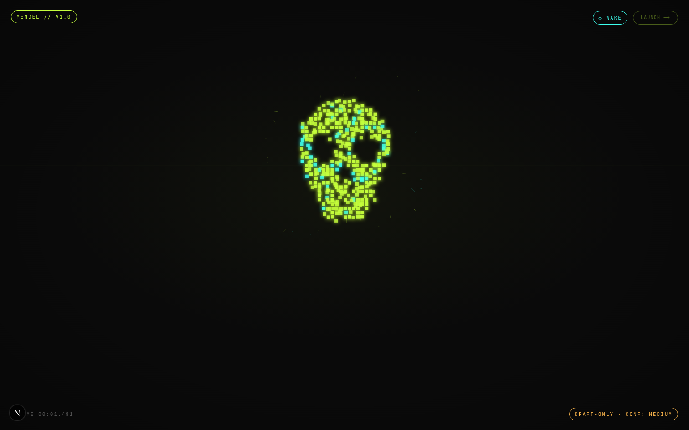
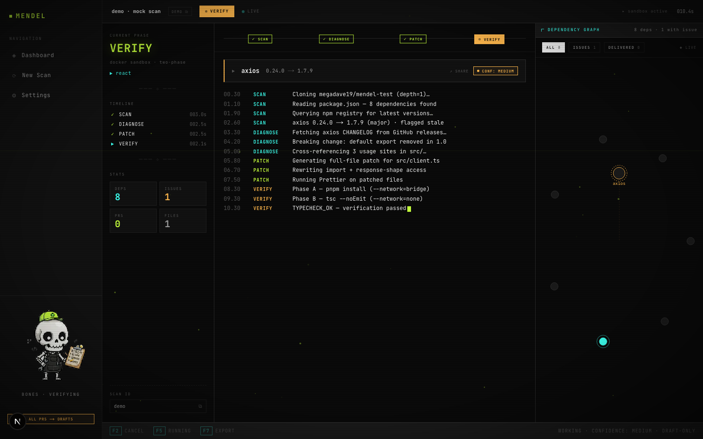
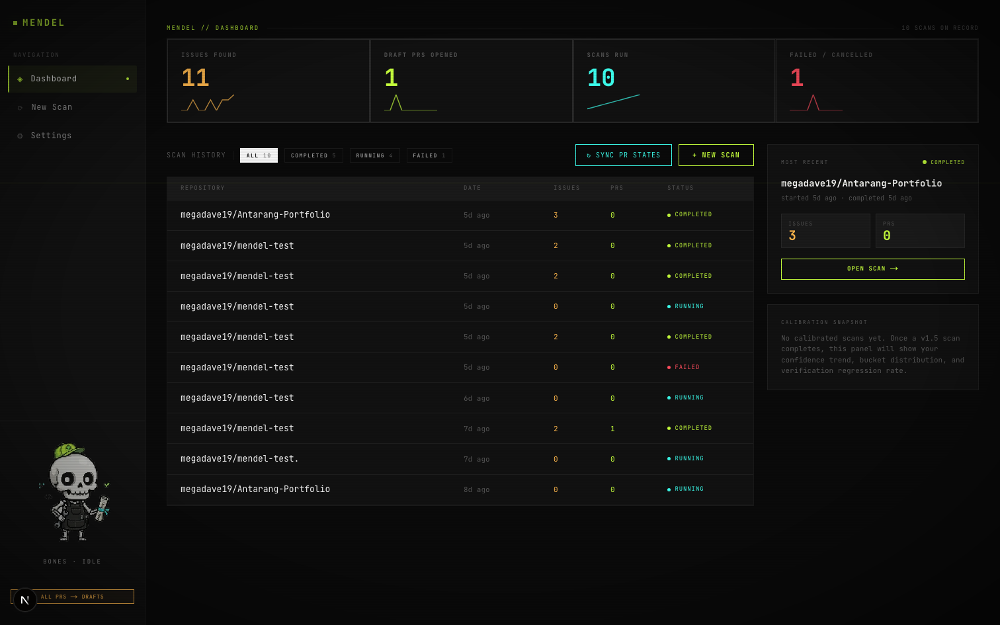
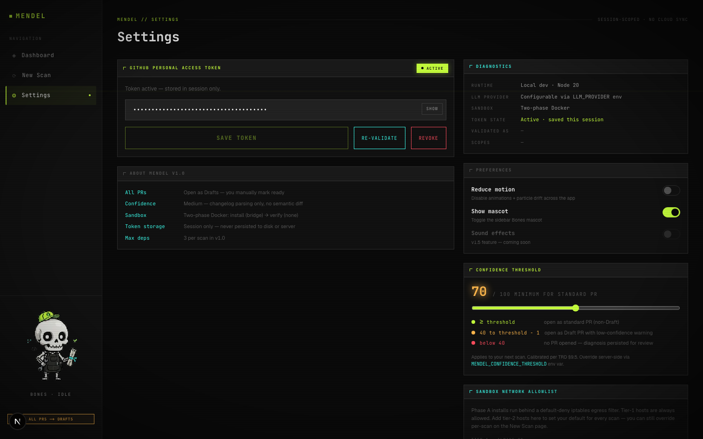
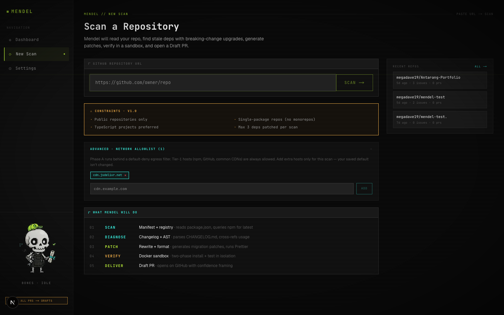

<div align="center">



# Mendel

### An autonomous AI agent that maintains GitHub repositories — it finds stale dependencies with breaking changes, writes the migration patch, verifies it in a sandbox, and (optionally) opens + auto-merges a real PR with cited evidence.

**Dependabot tells you a dependency is stale. Mendel ships the upgrade with the breaking-change patches already applied — scored by dual independent signals, verified offline in Docker, and honest about what it didn't analyze.**

<br/>


</div>

---

## Table of Contents

- [Why Mendel](#why-mendel)
- [What's new in v2](#whats-new-in-v2)
- [Screenshots](#screenshots)
- [How it works](#how-it-works)
- [The honesty contract](#the-honesty-contract)
- [Architecture](#architecture)
- [Tech stack](#tech-stack)
- [Security model](#security-model)
- [Testing strategy](#testing-strategy)
- [Project journey](#project-journey)
- [Getting started](#getting-started)
- [MCP integration](#mcp-integration)
- [A note on scope](#a-note-on-scope)

---

## Why Mendel

Keeping a project's dependencies current is tedious and risky. Automated bots
(Dependabot, Renovate) are great at telling you *that* a version is behind — but
when the upgrade is a **major version with breaking changes**, they hand you a
red CI run and walk away. Someone still has to read the changelog, find the
broken call sites, write the migration, and prove it works.

**Mendel does that part.** Point it at a public repo and it will:

1. **Detect** stale dependencies whose latest version is a breaking major — in
   **TypeScript, Python, Go, or Rust** repos (monorepos included).
2. **Diagnose** the actual breaking changes — cited to the source changelog *and*
   verified against a real semantic API diff produced by the language's canonical
   analyzer (`tsc`, `griffe`, `apidiff`, `cargo-semver-checks`).
3. **Patch** your code (full-file or search/replace blocks), normalized with the
   ecosystem's standard formatter.
4. **Verify** the patch in an isolated **three-phase Docker sandbox**: Phase A
   (install, network=bridge + iptables allowlist), Phase B (test, network=none),
   Phase C (smoke / app boot, network=none).
5. **Submit** a Draft PR with a calibrated confidence score, per-signal breakdown,
   and an explicit "Not Analyzed" disclosure.
6. **Auto-merge** the safe ones — under an opt-in, multi-rule §5c envelope (high
   confidence + signals agree + tests + smoke + no rejection history + dwell window).
7. **Keep watching** — a cron worker re-scans on your schedule and re-runs the
   loop.
8. **Talk to AI tools** — every action is also exposed as an MCP tool over stdio,
   so Claude Code / Cursor / any MCP client can drive the agent.

The differentiator isn't that it writes code — it's that it's **calibrated and
honest** about how confident it should be, and it never claims more than it
verified.

---

## What's new in v2

| Release | Feature | What it does |
|---|---|---|
| **v2.0** | Eval bench (`pnpm eval`) | Calibration regression suite. Every release runs 14 fixture cases against the scorer; a committed baseline report makes calibration drift stop-the-line. |
| **v2.0** | Smoke test (Phase C) | After Phase B tests pass, Mendel attempts to **boot the patched app** under `--network=none`. A smoke failure caps the confidence score at 50. |
| **v2.1** | Monorepo support | pnpm / yarn / npm workspaces + lerna + nx + turbo. Per-package scanning + per-package issue chips on Live Console. |
| **v2.1** | Inspect mode (`/inspect`) | Point at any package version pair (without a repo) and get a structural-API report. Bucket is structurally capped ≤ medium — never claims "high" without a repo to verify against. |
| **v2.2** | Polyglot — Python | `griffe`-based semantic diff in a `python:3.13-slim` sandbox. Real findings against PyPI. |
| **v2.2** | Polyglot — Go | `golang.org/x/exp/cmd/apidiff` in a `golang:1.x` sandbox. Real findings against `proxy.golang.org`. |
| **v2.2** | Polyglot — Rust | `cargo-semver-checks` in a `rust:1` sandbox. **First binding test of the language-aware confidence ceiling** — Rust caps at the `medium` bucket because cargo-semver-checks is public-API-only. |
| **v2.3** | Auto-merge (F24) | Pure §5c "Honesty-of-Action floor" policy + GitHub merge API + cancelable dwell window + per-decision AgentLog. Default OFF at the schema level; opt-in per repo. |
| **v2.3** | Continuous monitor (F25) | `node-cron` worker (`pnpm monitor`). Per-repo schedules with encrypted PATs, 5-minute floor between fires, 2 concurrent scan cap. |
| **v2.3** | MCP server (F26) | `pnpm mcp` exposes 8 tools over stdio (4 read-only + 4 action). Claude Code, Cursor, and any MCP client can drive scans, run inspections, read auto-merge verdicts, and list monitor schedules. |

---

## Screenshots

### Live Console — watch the agent reason in real time
The agent streams every phase over SSE: clone → detect → diagnose (changelog +
semantic-diff in the right per-language analyzer) → patch → three-phase sandbox
verification → calibrated confidence score → submission (Draft / standard PR /
auto-merge).



### Dashboard — scan history, calibration trends, PR-state sync


### Settings — threshold, allowlist, auto-merge, monitor schedules
Tune the score threshold that gates standard vs. Draft PRs, manage the tier-2
iptables egress allowlist, opt-in to per-repo auto-merge (with required
acknowledgement copy), and configure monitor cron schedules.


### New Scan


---

## How it works

```
            ┌──────────┐   ┌───────────┐   ┌──────────┐   ┌──────────────┐   ┌─────────┐   ┌──────────┐
  repo URL →│   SCAN   │ → │  DIAGNOSE │ → │  PATCH   │ → │    VERIFY    │ → │  SCORE  │ → │  SUBMIT  │
            └──────────┘   └───────────┘   └──────────┘   └──────────────┘   └─────────┘   └──────────┘
                 │              │               │              │                  │             │
          adapter picks    changelog ×      full-file /    A: install        calibrated    Draft PR  /
          per language:    semantic-diff    search-replace    (bridge,         confidence    standard /
          tsc /            (3-tier on TS;   + ecosystem        iptables)        + bucket     auto-merge
          griffe /         griffe / apidiff formatter        B: test            + reasons    (under §5c
          apidiff /        / cargo-semver                      (network=none)                 envelope)
          cargo-semver                                       C: smoke
                                                              (network=none)
```

**Dual-signal detection.** Two independent analyses run in parallel:

- **Changelog signal** — parses the package's published changelog / release notes
  for documented breaking changes, with source URL cited in the PR.
- **Semantic-diff signal** — runs the **language's canonical API differ** between
  the old and new versions, inside a per-language Docker sandbox image:

  | Language | Tool | Image |
  |---|---|---|
  | TypeScript | `tsc` (3-tier: `.d.ts` → JSDoc-emit → AST) | `mendel-sandbox:v2.2` |
  | Python | `griffe find_breaking_changes` | `mendel-python-sandbox:v2.2` |
  | Go | `golang.org/x/exp/cmd/apidiff` | `mendel-go-sandbox:v2.2` |
  | Rust | `cargo-semver-checks` (public-API only — caps confidence at `medium`) | `mendel-rust-sandbox:v2.2` |

When the two signals **disagree**, that's surfaced as *lower* confidence — never
papered over.

---

## The honesty contract

Mendel's ethical floor is honest framing of what the agent actually knows. This
is enforced in code, not just intention:

- **Calibrated, asymmetric scoring.** A breaking change confirmed by both signals
  scores high; a single weak signal scores low; signal disagreement scores
  honestly low.
- **Language-aware ceiling.** Each adapter declares the highest bucket its
  analyzer can honestly reach (TS/Python/Go = `high`; Rust = `medium`). The
  scorer's `clampToMaxBucket` enforces it regardless of numeric score.
- **Verification cap.** A Phase B (test) or Phase C (smoke) failure caps overall
  score at 50, forcing the `low` bucket regardless of detection confidence.
- **Threshold gating.** `score ≥ threshold` → standard PR · `40 ≤ score < threshold`
  → **Draft** PR with a low-confidence warning · `score < 40` → **no PR**, diagnosis
  surfaced for manual review.
- **§5c Honesty-of-Action floor** — auto-merge is a hard envelope, not a heuristic.
  ALL of these must hold: opt-in per repo (default OFF at schema level), PAT
  merge rights, patch/minor only, both signals report zero breakages and agree,
  confidence ≥ 90 hard-clamped, verification AND smoke passed, no prior rejection
  history. The bar to **act** is strictly higher than the bar to **suggest**.
- **§5c.1 Contribution eligibility** — Mendel refuses to open PRs on repos that
  already automate dependencies (Dependabot/Renovate detected) or whose
  CONTRIBUTING discourages drive-by PRs. Owned repos contribute freely; external
  repos report-only unless explicitly acknowledged.
- **Coverage is reported.** "Analyzed X of Y exported symbols (Z%)."
- **Every PR carries a "Not Analyzed" section.**
- **No breaking change is asserted without its source citation.**
- **Every auto-merge skip reason is logged** to `AgentLog` — no silent action,
  no silent skip.

---

## Architecture

```
mendel/
├── app/                      # Next.js 15 App Router (marketing + authed app)
│   ├── (app)/scan/[id]/       # Live Console — issue/PR detail inline + permalinks
│   ├── (app)/dashboard/       # scan history, calibration trends, PR-state sync
│   ├── (app)/inspect/         # F22 — point at any package version pair
│   ├── (app)/settings/        # PAT · threshold · allowlist · auto-merge · monitor
│   └── api/                   # scans, inspect, repo-settings, monitor-schedules,
│                              # agent-log (all Zod + rate-limited)
├── lib/
│   ├── agent/
│   │   ├── phases/            # scan · diagnose · patch · verify · smoke · submit
│   │   ├── signals/           # changelog.ts · semantic-diff.ts (3-tier TS)
│   │   ├── confidence/        # asymmetric scoring · language-aware ceiling clamp
│   │   ├── lang/              # adapters: typescript · python · go · rust + registry
│   │   ├── workspace/         # monorepo detect (pnpm/yarn/npm/lerna/nx/turbo)
│   │   ├── automerge/         # pure §5c policy + IO glue (runner-glue)
│   │   ├── monitor/           # pure scheduler (cron validation + decideFire)
│   │   ├── patching/          # full-file + search/replace strategies
│   │   └── learning/          # rejection-learning loop (PR-state polling + embeddings)
│   ├── sandbox/               # Docker executors per language · iptables allowlist · LRU cache
│   ├── eval/                  # bench runner + scorer (`pnpm eval`)
│   ├── mcp/                   # pure tool registry (8 tools)
│   ├── github/                # octokit wrapper (clone, PR, merge, dedup, fork)
│   ├── llm/                   # provider-agnostic Gemini client
│   └── db/                    # Prisma + SQLite
├── worker/monitor.ts          # node-cron worker (`pnpm monitor`)
├── mcp/server.ts              # stdio MCP server (`pnpm mcp`)
├── docker/                    # one sandbox image per language + wrappers
├── eval/                      # bench fixtures + committed baseline (honesty anchor)
└── tests/                     # 693 unit + 17 real-Docker container tests
```

---

## Tech stack

| Layer | Choice |
|---|---|
| Framework | Next.js 15 (App Router, TypeScript strict) |
| Styling | Tailwind v4 + custom design tokens |
| Animation | Framer Motion + GSAP |
| 3D | Three.js (vanilla — R3F dropped on React 19) |
| State | Zustand |
| Database | SQLite + Prisma (every model `tenantId?` — v3-ready) |
| Validation | Zod (every API + worker + MCP tool boundary) |
| LLM | Google Gemini + github-models (provider-agnostic) |
| GitHub | Octokit |
| Sandboxes | Docker per language: Node + pnpm/yarn/npm, Python 3.13 + griffe, Go 1 + apidiff, Rust 1 + cargo-semver-checks |
| Semantic-diff | `tsc` · `griffe` · `apidiff` · `cargo-semver-checks` |
| Cron worker | `node-cron` (5-min floor, 2-concurrent cap) |
| MCP server | `@modelcontextprotocol/sdk` over stdio |
| Tests | Vitest + Playwright |
| Logging | Pino + per-decision AgentLog rows |

---

## Security model

Security was a first-class constraint, not an afterthought:

- **Three-phase sandbox.** Phase A (install) runs `--network=bridge` behind a
  **default-deny iptables egress filter** (only an allowlist of registries/CDNs
  is reachable); Phase B (test) and Phase C (smoke) run fully `--network=none`.
  All non-root, memory-capped, time-bounded, torn down after each run.
- **Per-language images** — Node, Python, Go, Rust each have their own
  `mendel-*-sandbox:v2.2` image. Every image has a **§11b.1 real-container
  test** that proves the toolchain is on PATH for the non-root user and
  produces real findings against a real public package.
- **Secrets never leave the server.** GitHub PATs are AES-256-GCM encrypted at
  rest (`ENCRYPTION_KEY` ≥ 32 chars). The MCP server's `mendel.monitor.list`
  returns `hasPat: boolean` — never the ciphertext, never the plaintext, never
  the field name.
- **The §5c envelope is a hard wall, not a heuristic.** A misconfigured low
  confidence floor in `RepoSetting` cannot unlock auto-merge — the policy
  hard-clamps the effective floor at `MAX(configured, hard-floor 90, threshold)`.
- **Every input is Zod-validated** server-side: API routes, MCP tool inputs,
  worker-loaded schedules, LLM outputs.
- **The MCP server is stdio-only.** The `@modelcontextprotocol/sdk/server/express`
  HTTP transport is intentionally never imported (per the forbidden-pattern list).
- **Eval is CLI-only.** No HTTP exposure.
- File operations are sandboxed to `./workspace` and `./logs` with path-escape
  rejection.

---

## Testing strategy

This is a project explicitly built to defend against the failure mode of
plausible-looking-but-broken AI-generated code:

- **693 unit/integration tests** — pure logic (confidence math, §5c envelope,
  cron validation, MCP tool routing, AnyTool registry contracts) exhaustively
  unit-tested and deterministic
- **17 real-container tests** — gated behind `pnpm test:docker`. Each sandbox
  image is verified end-to-end: image builds, toolchain on PATH for non-root
  user, real package pair returns real findings, adapter round-trips into a
  valid `SemanticDiff`. **Bugs caught this way before merge in v2.2:** apidiff
  `-m` flag missing, cargo-semver-checks `--release-type=patch` needed (would
  skip all 253 lints on major bumps), griffe case-sensitive bucketing,
  libz-ng-sys cmake missing
- **Eval bench** (`pnpm eval`) — 14 fixture cases + a committed baseline report.
  A calibration regression vs. baseline is **stop-the-line**. Currently 14/14 at
  100% bucket accuracy + 100% range accuracy
- **Visual-regression snapshots** guard all primary screens

```bash
pnpm typecheck && pnpm lint && pnpm test    # 14s — gate before every commit
pnpm eval                                   # calibration bench vs. committed baseline
pnpm smoke                                  # Playwright E2E
pnpm test:docker                            # real-container sandbox tests (needs Docker)
```

---

## Project journey

Mendel was built in deliberate phases — a useful lens on how I scope and ship:

| Phase | Focus |
|---|---|
| **v1.0** — Working Demo | End-to-end agent: changelog detection, full-file patching, two-phase Docker sandbox, real Draft PRs on a live repo. |
| **Phase D** — Design Iteration | Rebuilt the visual layer to an Awwwards-tier cyberpunk-CRT brief; 2D mascot ("Bones") with per-phase reactions; hybrid screen architecture. |
| **v1.5** — Calibrated Confidence | Semantic API diffing, asymmetric dual-signal scoring, search/replace patching, iptables allowlist, `node_modules` LRU cache, rejection-learning loop, threshold-gated submission. |
| **v2.0** — Measure & Verify | Calibration bench (`pnpm eval` as honesty anchor) + Phase C smoke test (boot the patched app under `network=none`). |
| **v2.1** — Broader Repos | Monorepo support (pnpm/yarn/npm/lerna/nx/turbo) + F22 inspect mode (point at any API). |
| **v2.2** — Polyglot | Python + Go + Rust adapters via canonical analyzers (griffe / apidiff / cargo-semver-checks) — each in its own Docker sandbox with §11b.1 real-container tests. **First binding test of the language-aware confidence ceiling** (Rust → medium). |
| **v2.3** — Autonomy | Auto-merge under the §5c envelope, continuous monitor worker, MCP server (stdio). 12 commits, 0 calibration regressions, all features opt-in / default-OFF. |

Each phase had explicit "definition of done" gates and a spec-conformance audit
before anything was called finished.

---

## Getting started

> Mendel runs **locally only** (it is not a deployed service). You need Node 20+,
> pnpm 9+, Docker Desktop, and a Google Gemini API key.

```bash
pnpm install
cp .env.example .env          # fill GEMINI_API_KEY + ENCRYPTION_KEY (>= 32 chars)
pnpm db:push                  # set up the SQLite schema
docker compose build          # build the Node sandbox image (one-time)
pnpm dev                      # http://localhost:3000
```

Per-language sandbox images (`mendel-python-sandbox:v2.2`, `mendel-go-sandbox:v2.2`,
`mendel-rust-sandbox:v2.2`) build lazily on the first scan of a repo in that language.

Connect a GitHub Personal Access Token in **Settings**, paste a public repo URL
in **New Scan**, and watch the Live Console.

### Optional workers

```bash
pnpm monitor    # node-cron worker — runs every enabled MonitorSchedule on its cadence
pnpm mcp        # MCP stdio server — point your MCP client (Claude Code / Cursor / …) at it
pnpm eval       # run the calibration bench vs. the committed baseline
```

---

## MCP integration

Mendel exposes 8 tools over the Model Context Protocol (stdio transport):

| Tool | Type | What it does |
|---|---|---|
| `mendel.health` | read | Server time + capability check |
| `mendel.scan.list` | read | Recent scans (newest first; optional status filter) |
| `mendel.scan.get` | read | One scan + its issues (PAT fields stripped) |
| `mendel.inspect.list` | read | Recent F22 inspections |
| `mendel.scan.start` | action | Start a headless scan (PAT encrypted before persist) |
| `mendel.inspect.run` | action | F22 inspect on a package version pair |
| `mendel.automerge.get-verdict` | read | The persisted §5c verdict for an issue, with every reason readable — the LLM-facing honesty surface |
| `mendel.monitor.list` | read | All monitor schedules (`hasPat: boolean` only) |

The same pure policy + IO functions back both the UI and the MCP tools — a caller
**cannot** bypass §5c eligibility / §5b confidence framing / §5 r5 PAT encryption
by going through MCP.

### Example: register Mendel as an MCP server in Claude Code

```json
{
  "mcpServers": {
    "mendel": {
      "command": "pnpm",
      "args": ["--silent", "mcp"],
      "cwd": "/absolute/path/to/your/mendel/checkout"
    }
  }
}
```

Then in Claude Code: *"Use mendel.scan.start to scan https://github.com/me/my-repo,
then call mendel.automerge.get-verdict on each issue and tell me which ones would
have auto-merged."*

---

## A note on scope

At moment Mendel is a demonstration project built to explore **autonomous,
verifiable, honestly-calibrated AI agents** — not a production SaaS. It runs on a
single machine, targets public repositories across four language ecosystems, and
defaults every action to opt-in / human-review. The interesting engineering is
in the verification and confidence-calibration layers, the language-aware
ceiling math, the §5c Honesty-of-Action floor, and the structural refusal to let
the agent overclaim.

Active work, known limitations, and future features are tracked in
[**Issues**](../../issues). Next directional bets: deeper multi-package
monorepo support, hosted/cloud deployment (Vercel + multi-tenant Postgres +
hosted sandbox via E2B/Fly), and broader MCP tool surface for richer agentic
flows.

<div align="center">
<br/>
<sub>Built with TypeScript, a lot of tests, and a strong opinion that AI tools should be honest about what they don't know.</sub>
</div>
